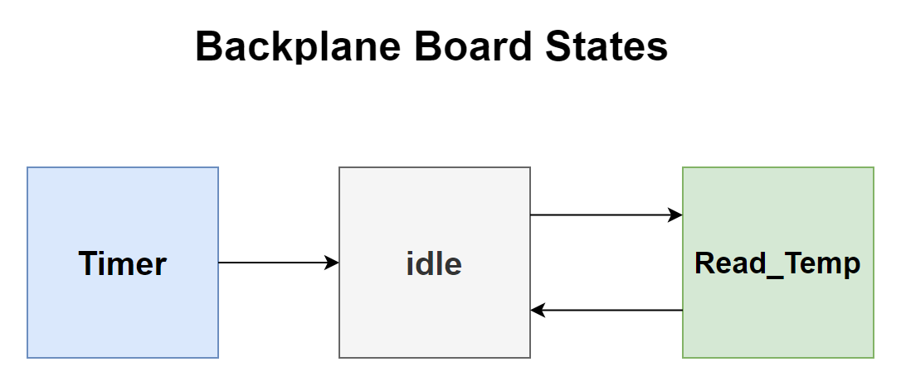

#   Backplane
The Backplane MCU serves as a deployment timer and IO expander for the OBC within the SC-Freyer. This system is structured according to an FSM (Finite State Machine) model, which consists of three stages.

<table>
    <tr>
        <td>Timer</td>
        <td>
            As soon as the board receives power, the MCU begins a 30-minute countdown, at the end of which it triggers an RLC circuit, thereby switching on the OBC.
        </td>
    </tr>
    <tr>
        <td>
            idle
        </td>
        <td>
            In idle mode the mcu is in sleep mod waiting on obc to send intrupt to check on the solar panels and its local thermistors
        </td>
    </tr>
    <tr>
        <td>
            Temperature Reading
        </td>
        <td>
            When the interrupt is received from the OBC, the program transitions to this state, reads the temperature, and sends the value back to the OBC, then returns to its idle state.
        </td>
    </tr>
</table>

 
 

